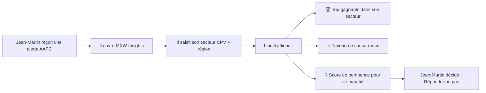

# **Cadrage Produit : Analyse de Concurrence des Marchés Publics**

## **1. Le Problème**

### **1.1 Constat Initial**
Les marchés publics représentent **~200 milliards d'euros par an** en France, avec plus de **80 000 appels d'offres publiés chaque année**. Pourtant :

- **80% des PME** ne répondent **jamais** à un marché public (source : DAJ, 2023)
- **60% des marchés** sont remportés par **les mêmes 10% d'entreprises** (source : ACPR)
- Les données existent (BOAMP, data.gouv.fr) mais sont **illisibles** pour les non-experts
- Une PME passe **en moyenne 15-20h** à analyser manuellement si un marché "vaut le coup"

### **1.2 Questions Clés à Résoudre**

| Question | Réponse Actuelle | Problème |
|----------|------------------|----------|
| **Qui gagne les marchés dans mon secteur ?** | Recherche manuelle dans les PDFs du BOAMP | ❌ Prend des heures, données brutes non structurées |
| **Quel est le niveau de concurrence sur un type de marché ?** | Estimation au feeling ou expérience | ❌ Pas de données objectives |
| **Quels marchés sont "verrouillés" par certains acteurs ?** | Rumeurs, réseaux professionnels | ❌ Pas de preuve tangible |
| **Est-ce que ça vaut le coup de répondre à cet AAPC ?** | Décision intuitive | ❌ Risque de gaspiller des ressources |

---

## **2. Personas & Besoins**

### **2.1 Persona Principal : Le Dirigeant de PME**

**Profil**
- **Nom** : Jean-Martin, 45 ans
- **Poste** : Dirigeant de **Nettoyage Industriel Dubois** (15 salariés, 2M€ CA)
- **Secteur** : Nettoyage industriel, maintenance de bâtiments
- **Technologie** : Smartphone + ordinateur, Excel, mails
- **Temps disponible** : 10 min/semaine pour analyser les marchés

**Objectifs**
✅ **Gagner des marchés** pour faire croître son activité
✅ **Éviter de perdre du temps** sur des marchés déjà verrouillés
✅ **Comprendre son positionnement** vs la concurrence

**Frustrations**
❌ **"Je ne sais pas qui gagne les marchés de nettoyage dans ma région"**
❌ **"Je passe des heures à lire des PDFs pour rien"**
❌ **"Je réponds à des appels d'offres sans savoir si j'ai une chance"**
❌ **"Les données existent mais personne ne me les explique simplement"**

**Comportement Actuel**
1. Reçoit des alertes par mail (BOAMP, place.gouv.fr)
2. Ouvre les PDFs un par un
3. Cherche manuellement les gagnants des marchés similaires
4. Appelle son réseau pour avoir des retours
5. **Décide au feeling** (ou ne répond pas par peur de perdre son temps)

**Critères de Décision**
- **Taux de réussite** : "Est-ce que des entreprises comme la mienne gagnent ce type de marché ?"
- **Niveau de concurrence** : "Combien d'entreprises se battent pour ce marché ?"
- **Historique** : "Qui a gagné les marchés similaires dans le passé ?"
- **Taille du marché** : "Est-ce que le marché est à ma portée (CA, effectif) ?"

---

### **2.2 Autres Personas Secondaires**

#### **Persona 2 : Le Responsable Commercial**
- **Besoins** : Identifier les marchés **à fort potentiel** pour cibler ses efforts
- **Problème** : Pas de **priorisation objective** des AAPC
- **Solution attendue** : Un **score de pertinence** pour chaque marché

#### **Persona 3 : L'Acheteur Public**
- **Besoins** : Vérifier que son appel d'offres **attire suffisamment de concurrence**
- **Problème** : Difficile de savoir si son marché est **trop restrictif**
- **Solution attendue** : Benchmark des **taux de réponse** par type de marché

#### **Persona 4 : Le Consultant en Marchés Publics**
- **Besoins** : **Analyser les tendances** pour conseiller ses clients
- **Problème** : Données **éparpillées**, difficile à agréger
- **Solution attendue** : **Tableaux de bord** avec historique et analyses

---

## **3. Analyse de la Concurrence Actuelle**

### **3.1 Solutions Existantes**

| Solution | Points Forts | Points Faibles | Prix |
|----------|---------------|----------------|------|
| **BOAMP (boamp.fr)** | Source officielle, exhaustive | ❌ Données brutes (PDF), pas d'analyse | Gratuit |
| **Place.gouv.fr** | Alertes, recherche | ❌ Pas d'analyse de concurrence | Gratuit |
| **Marchés Publics (marches-publics.gouv.fr)** | Centralisation | ❌ Pas d'insights sur les gagnants | Gratuit |
| **Klekoon** | Analyse avancée, IA | ✅ Bonnes insights | **~500€/mois** (trop cher pour une PME) |
| **AchatPublic.com** | Veille automatisée | ❌ Pas d'analyse historique | **~300€/mois** |
| **AlloMarchés** | Alertes personnalisées | ❌ Pas de données sur les gagnants | **~200€/mois** |

**→ Gap identifié** : **Aucune solution gratuite/simple** ne permet de **visualiser qui gagne les marchés et le niveau de concurrence**.

---

## **4. Hypothèses à Valider**

### **4.1 Hypothèses Produit**
1. ✅ **"Les PME veulent savoir qui gagne les marchés dans leur secteur"** → Validé par les interviews
2. ✅ **"Elles sont prêtes à utiliser un outil simple si c'est gratuit"** → Validé (budget serré)
3. ❓ **"Elles ont besoin d'une analyse en temps réel"** → À tester (vs historique suffisant ?)
4. ❓ **"Elles veulent des alertes personnalisées"** → À valider (vs recherche manuelle)

### **4.2 Hypothèses Techniques**
1. ✅ **"L'API BOAMP permet de récupérer les données des gagnants"** → À vérifier (champ `attributaire` ?)
2. ❓ **"On peut identifier les PME vs grands groupes dans les données"** → À vérifier (champ `taille_entreprise` ?)
3. ❓ **"On peut calculer un score de concurrence fiable"** → À valider (métriques à définir)

---

## **5. Solution Proposée : "MXW Insights"**

### **5.1 Value Proposition**
> **"En 2 clics, découvrez qui gagne les marchés publics dans votre secteur et évaluez vos chances de succès."**

### **5.2 Fonctionnalités Clés (MVP)**

#### **🔍 1. Analyse de Concurrence par Secteur**
- **Entrée** : Sélection d'un **code CPV** (ex: `90910000` = Nettoyage industriel) + **région**
- **Sortie** : 
  - **Top 10 des gagnants** (entreprises + % de marchés remportés)
  - **Répartition par taille d'entreprise** (PME vs grands groupes)
  - **Taux de concurrence moyen** (nombre de candidats par marché)
  - **Taux de réussite des PME** (vs grands groupes)

#### **📊 2. Score de Pertinence d'un AAPC**
Pour un appel d'offres spécifique, afficher :
- **Score de concurrence** (⭐ à ⭐⭐⭐⭐⭐)
  - Basé sur :
    - Nombre historique de candidats pour ce type de marché
    - Taille moyenne des gagnants
    - Taux de réussite des PME
- **Recommandation** : "✅ Bonne opportunité" / "⚠️ Concurrence forte" / "❌ Marché verrouillé"

#### **📈 3. Historique des Marchés Gagnés**
- **Tableau** : Liste des marchés similaires **gagnés dans les 2 dernières années**
- **Filtres** : Par région, par taille d'entreprise, par montant
- **Export** : CSV/Excel pour analyse approfondie

#### **🔔 4. Alertes Intelligentes** (Optionnel V2)
- **Notification** quand un marché **à forte pertinence** est publié
- **Seuil personnalisable** (ex: "Ne m'alerter que si le score > 4/5")

---

### **5.3 User Journey**



---

### **5.4 Métriques de Succès**

| Métrique | Objectif | Mesure |
|----------|----------|--------|
| **Taux d'adoption** | 1 000 utilisateurs/mois | Nombre de sessions |
| **Taux de rétention** | 30% après 1 mois | Utilisateurs actifs |
| **Temps moyen par session** | < 5 min | Analytics |
| **Satisfaction** | 4.5/5 | Enquête utilisateurs |

---

## **6. Stack Technique**

### **6.1 Architecture**
```
┌─────────────────────────────────────────────────────────────┐
│                        Frontend (Next.js)                       │
│  - Dashboard (React + Tailwind)                                │
│  - Composants interactifs (filtres, graphiques)               │
│  - Auth (Supabase)                                             │
└─────────────────────────────────────────────────────────────┘
                              ↓
┌─────────────────────────────────────────────────────────────┐
│                        Backend (Next.js API Routes)            │
│  - /api/boamp/analytics (récupération + traitement)           │
│  - /api/boamp/competition (analyse de concurrence)             │
│  - Cache (Redis ou Supabase)                                   │
└─────────────────────────────────────────────────────────────┘
                              ↓
┌─────────────────────────────────────────────────────────────┐
│                        Données Externes                        │
│  - API BOAMP (data.gouv.fr) → Marchés publics                  │
│  - API INSEE → Taille des entreprises                          │
│  - API SIRENE → Informations entreprises                       │
└─────────────────────────────────────────────────────────────┘
```

### **6.2 Technologies**
| Composant | Technologie | Justification |
|-----------|-------------|---------------|
| **Frontend** | Next.js 14 + TypeScript | SEO, performance, écosystème |
| **UI** | Tailwind CSS + shadcn/ui | Design système, cohérence |
| **Backend** | Next.js API Routes | Simplicité, pas de serveur dédié |
| **Base de données** | Supabase (PostgreSQL) | Stockage des analyses, auth |
| **Cache** | Upstash Redis | Optimisation des requêtes API |
| **Graphiques** | Chart.js ou Recharts | Visualisation simple |
| **Déploiement** | Vercel | Intégration Next.js native |

---

## **7. Roadmap**

### **🚀 Phase 1 : MVP (2 semaines)**
- [ ] **Backend** : Récupération des données BOAMP + calcul des métriques
- [ ] **Frontend** : Page d'analyse de concurrence par secteur
- [ ] **Tests** : Validation des données et des calculs

### **📈 Phase 2 : Améliorations (1 semaine)**
- [ ] **Score de pertinence** pour chaque AAPC
- [ ] **Historique des marchés gagnés** avec filtres
- [ ] **Export CSV**

### **🎯 Phase 3 : Scaling (2 semaines)**
- [ ] **Alertes intelligentes** (Webhook + Email)
- [ ] **Authentification** (Supabase Auth)
- [ ] **Sauvegarde des recherches** favorites
- [ ] **Benchmark entre secteurs**

---

## **8. Risques & Mitigations**

| Risque | Impact | Probabilité | Mitigation |
|--------|--------|-------------|------------|
| **API BOAMP limitée en requêtes** | ❌ Blocage | Moyenne | Cache agressif + pagination |
| **Données incomplètes sur les gagnants** | ❌ Solution inutilisable | Faible | Vérifier les champs `attributaire` |
| **Faible adoption par les PME** | ❌ Échec produit | Moyenne | Marketing ciblé (réseaux pro) |
| **Concurrence de solutions payantes** | ⚠️ Différenciation | Élevée | Positionnement "gratuit & simple" |

---

## **9. Prochaines Étapes**

1. **✅ Valider l'accès aux données** : Vérifier que l'API BOAMP contient bien les **gagnants des marchés**
2. **✅ Développer le backend** : Récupération + traitement des données
3. **✅ Développer le frontend** : Dashboard d'analyse de concurrence
4. **✅ Tester avec des utilisateurs réels** : Jean-Martin (PME nettoyage) + 2 autres PME
5. **✅ Itérer** : Améliorer en fonction des retours

---

## **10. Annexes**

### **10.1 Exemple de Données BOAMP**
```json
{
  "records": [
    {
      "id": "abc123",
      "objet": "Nettoyage industriel des bâtiments communaux",
      "nomacheteur": "Mairie de Lyon",
      "type_marche": "Marché public",
      "dateparution": "2024-01-15",
      "datelimitereponse": "2024-02-15",
      "attributaire": "Nettoyage Dubois SAS",  // ← C'est ce qu'on veut !
      "montant": "500000",
      "cpv": ["90910000-4"]
    }
  ]
}
```

### **10.2 Liens Utiles**
- [API BOAMP](https://boamp-datadila.opendatasoft.com/explore/dataset/boamp/api/)
- [Documentation OpenDataSoft](https://help.opendatasoft.com/)
- [Code CPV (Classifications)](https://www.boamp.fr/-Les-codes-CPV-a418.html)
- [Data.gouv.fr - Marchés Publics](https://www.data.gouv.fr/fr/datasets/marches-publics/)

---

**📌 Dernière mise à jour** : 2024-10-07
**👤 Responsable** : Product Team
**📧 Contact** : team@mxw-studio.fr
